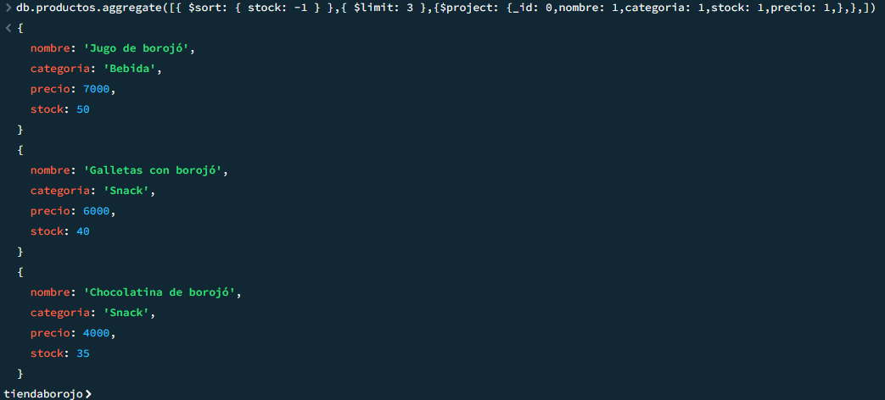

# La tienda del borojó - MongoDB

## Descripción 

Este proyecto implementa una base de datos MongoDB para "La tienda del borojó", una tienda especializada en productos derivados del borojó.

## Tienda

Comercializa diversos productos como:
- Frutas frescas y deshidratadas
- Bebidas (jugos, concentrados, cerveza artesanal)
- Alimentos (mermeladas, galletas, compotas)
- Productos cosméticos (aceites)
- Postres (helados)

El sistema permite gestionar el inventario, registrar ventas, mantener información de clientes y proveedores, y generar reportes de análisis.

## Estructura de la base de datos

### Colecciones:

- **productos**: Información de productos disponibles
- **clientes**: Datos de clientes y sus preferencias
- **ventas**: Registro de transacciones de venta
- **proveedores**: Información de proveedores
- **inventario**: Control de stock por lotes

## Instrucciones para ejecutar

abrir los archivos enlazados y se puede observar los script para la realizacion de cada requerimiento 

1. **Configurar la base de datos:**
  ``
  use tiendaborojo
  ``

2. **Insertar datos iniciales:**
    ``
    db.coleccion.insertMany({json})
    ``
    - [productos](productos.json)
    - [clientes](clientes.json)
    - [ventas](ventas.json)
    - [proveedores](proveedores.json)
    - [inventario](inventario.json)

va a variar la "coleccion" dependiendo la especificada y el "json" debe insertarse de acuerdo a la coleccion, se encuentran en cada uno de los archivos json agregados

3. **Ejecutar Insercion, lectura, actualización y eliminación:**

    - [Insercion](insercion.js)
    - [Lectura](lectura.js)
    - [Actualización](actualización.js)
    - [Eliminación](eliminación.js)

4. [**Probar consultas con expresiones regulares**](expresionesR.js)

5. [**Ejecutar operadores de arrays**](opArrays.js)

6. [**Aggregation Framework con Pipelines**](pipelines.js)

7. [**Funciones del sistema:**](funciones.js)

8. [**Transacciones**](transacciones.js)

